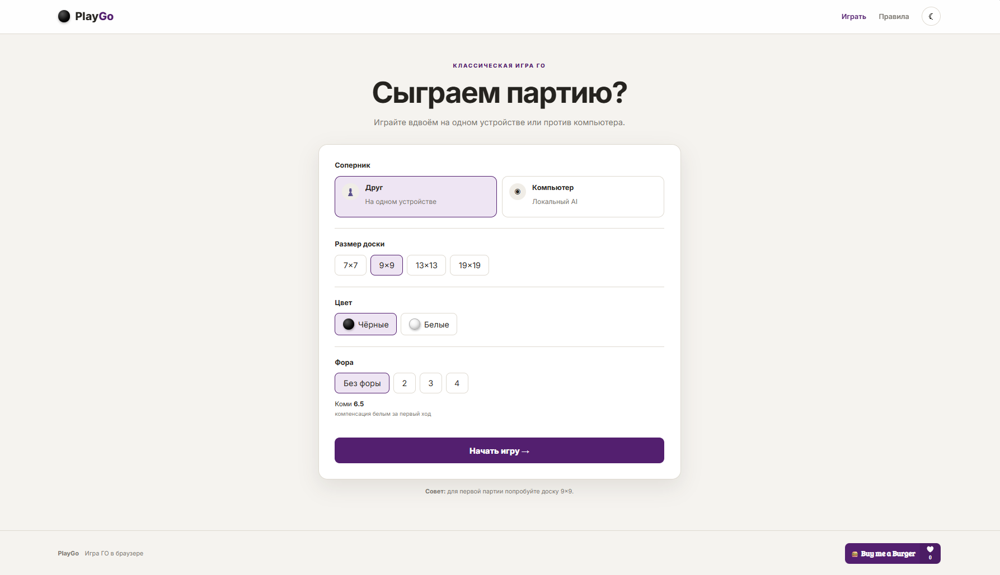
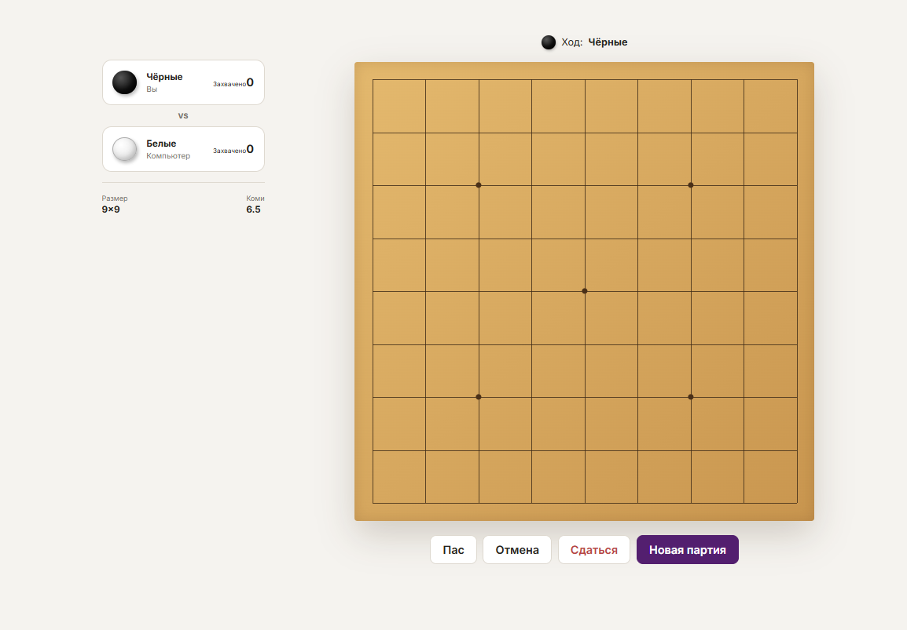
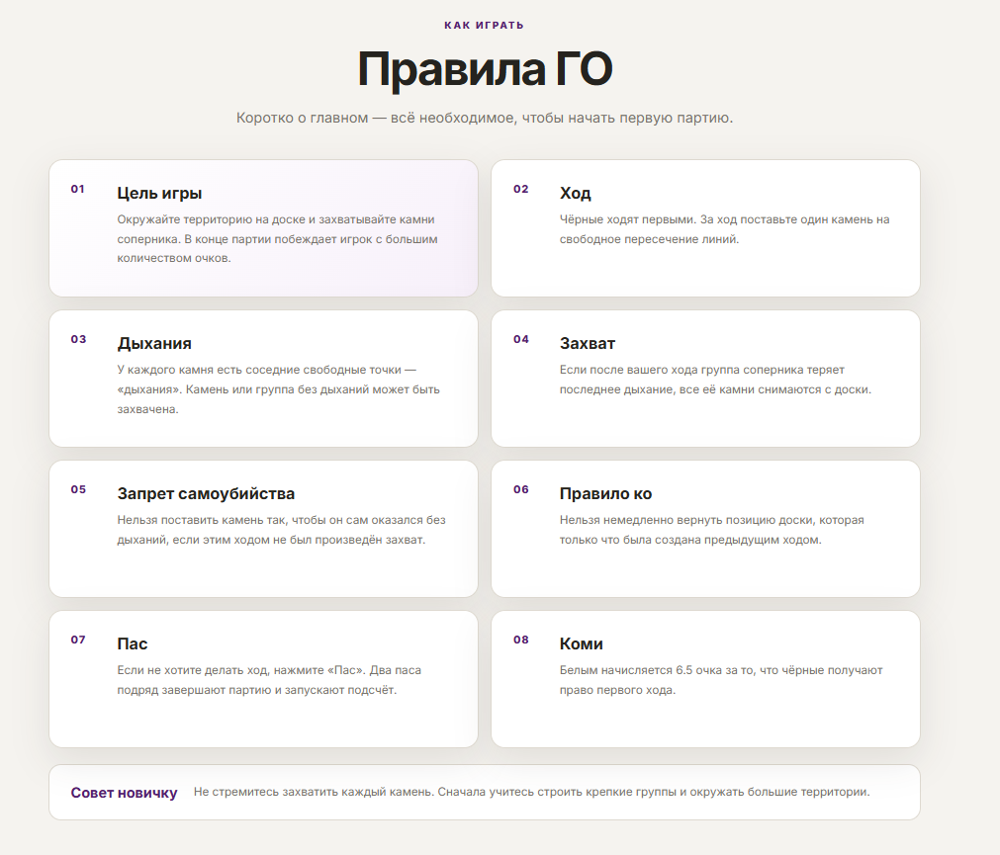
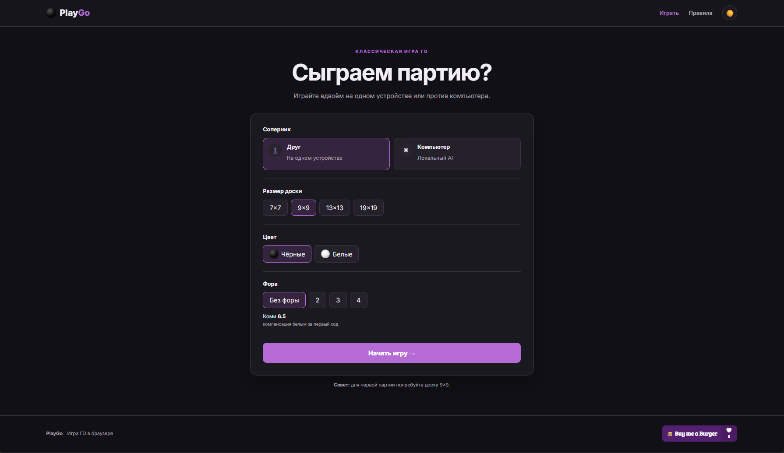

# 🎯 PlayGo — браузерная игра ГО

**PlayGo** — это современная браузерная версия настольной игры **ГО**, написанная на чистом **HTML, CSS и JavaScript**.

Проект создан с акцентом на простой интерфейс, возможность быстро начать партию и работу прямо в браузере без установки дополнительных зависимостей.

> 🎮 Играйте вдвоём на одном компьютере или попробуйте локального AI.

---

## ✨ Возможности

- 🎮 Игра против другого игрока на одном компьютере
- 🤖 Локальный AI-соперник
- 🧠 Несколько уровней сложности AI
- ⚫⚪ Выбор цвета камней
- 📐 Размеры доски:
  - 7×7
  - 9×9
  - 13×13
  - 19×19
- 🪨 Камни ГО с визуальным эффектом объёма
- 🏯 Поддержка форы: 2, 3 или 4 камня
- ➕ Коми 6.5
- ✋ Пас
- ↩️ Отмена хода
- 🏳️ Сдача партии
- 🏆 Подсчёт результата
- 🔄 Новая партия
- 📖 Отдельная вкладка с правилами ГО
- 🌙 Тёмная тема
- ☀️ Светлая тема
- 💾 Сохранение выбранной темы в браузере
- 📱 Адаптивный интерфейс для небольших экранов
- ☕ Кнопка поддержки проекта через BuyMeACoffee

---

## 🖼️ Скриншоты

> Здесь можно разместить реальные скриншоты проекта после загрузки их в репозиторий.

### 🎮 Главное меню



### ⚫ Игровое поле



### 📖 Правила



### 🌙 Тёмная тема



---

## 🚀 Запуск

PlayGo не требует Node.js, Python, npm или других зависимостей.

### Вариант 1 — открыть напрямую

Скачайте или клонируйте репозиторий и откройте файл:

```text
index.html
```

в любом современном браузере.

### Вариант 2 — через VS Code

1. Откройте папку проекта в **Visual Studio Code**.
2. Установите расширение **Live Server**.
3. Нажмите правой кнопкой по `index.html`.
4. Выберите **Open with Live Server**.

После этого PlayGo откроется в браузере.

---

## 📁 Структура проекта

```text
PlayGo/
├── index.html      # Интерфейс игры
├── style.css       # Стили и темы
├── script.js       # Игровая логика
├── README.md       # Документация
└── screenshots/    # Скриншоты проекта (опционально)
```

---

## 🎲 Как играть

### 1. Выберите соперника

На стартовом экране можно выбрать:

- **Друг** — два игрока играют по очереди на одном компьютере.
- **Компьютер** — партия против локального AI.

### 2. Выберите доску

Доступны четыре размера:

```text
7×7
9×9
13×13
19×19
```

Для первой партии рекомендуется **9×9**.

### 3. Настройте партию

При игре против компьютера можно выбрать уровень AI и цвет камней.

Также доступны фора и коми.

### 4. Делайте ходы

Нажмите на пересечение линий доски, чтобы поставить камень.

Во время партии доступны:

- **Пас** — пропустить ход;
- **Отмена** — отменить предыдущий ход;
- **Сдаться** — завершить партию и признать поражение.

Два последовательных паса завершают партию.

---

## 📖 Правила ГО

В PlayGo есть отдельная вкладка **«Правила»**, где кратко объясняются основные механики:

- цель игры;
- постановка камней;
- дыхания групп;
- захват камней;
- правило самоубийства;
- правило ко;
- пас;
- подсчёт результата;
- коми.

---

## 🤖 AI

Компьютерный соперник работает непосредственно в браузере и не требует подключения к серверу.

Доступны уровни:

- **Легко**
- **Средне**
- **Сложно**

AI анализирует доступные ходы и оценивает их по нескольким простым параметрам, включая захваты, положение относительно центра и соседние камни.

> Это локальный игровой AI, а не полноценный профессиональный движок ГО.

---

## 🌗 Светлая и тёмная тема

В правой части шапки находится переключатель темы.

Нажмите:

```text
☾
```

чтобы перейти в тёмную тему, или:

```text
☀
```

чтобы вернуться к светлой.

Выбранная тема сохраняется в `localStorage`, поэтому после перезагрузки страницы настройка остаётся.

---

## 🛠️ Технологии

Проект создан без фреймворков:

- **HTML5** — структура приложения
- **CSS3** — оформление, адаптивность и темы
- **JavaScript** — игровая логика, AI и взаимодействие с интерфейсом
- **localStorage** — сохранение выбранной темы

---

## 🌐 GitHub Pages

PlayGo можно разместить на **GitHub Pages**, поскольку проект состоит из статических файлов.

После публикации сайт можно будет открыть по адресу примерно такого вида:

```text
https://USERNAME.github.io/PlayGo/
```

### Как включить GitHub Pages

1. Создайте репозиторий на GitHub.
2. Загрузите файлы проекта.
3. Откройте:
   **Settings → Pages**.
4. В разделе **Build and deployment** выберите:
   - Source: `Deploy from a branch`
   - Branch: `main`
   - Folder: `/ (root)`
5. Сохраните настройки.
6. Подождите завершения публикации.

После этого GitHub Pages выдаст ссылку на опубликованный PlayGo.

---

## ☕ Поддержать проект

Если PlayGo вам понравился, проект можно поддержать через BuyMeACoffee.

**Buy me a Burger 🍔**

---

## 📌 Планы развития

Возможные будущие улучшения:

- 🌐 онлайн-матчи между игроками;
- 🔗 комнаты и приглашения по ссылке;
- ⏱️ таймер партий;
- 📝 история ходов;
- 💬 чат в онлайн-комнатах;
- 🏆 рейтинг игроков;
- ⚙️ дополнительные настройки правил;
- 🧠 более продвинутый AI;
- 📊 более подробная статистика партии.

---

## 👨‍💻 Автор

**Pachicom**

GitHub: [Pachicom](https://github.com/Pachicom)

---

## 📄 Лицензия

Лицензия проекта пока не определена.

Если планируется открытая публикация проекта на GitHub, рекомендуется добавить отдельный файл `LICENSE` с выбранной лицензией.
